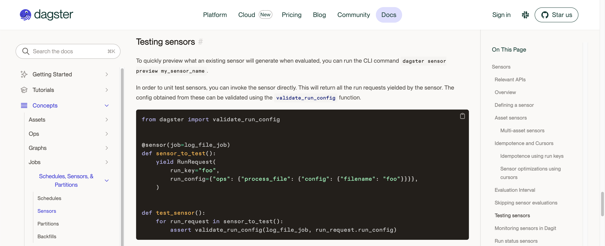
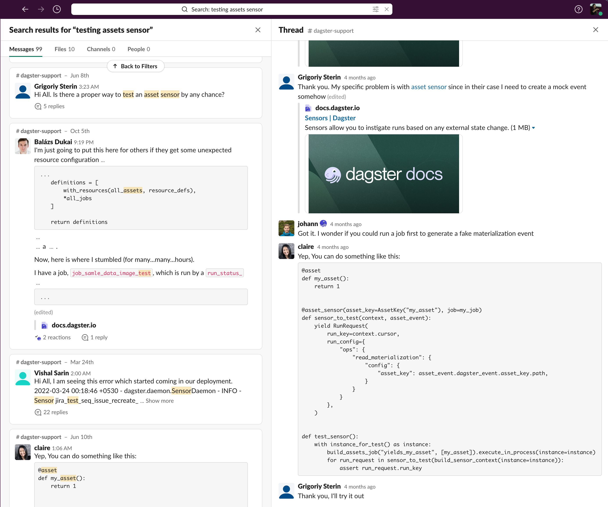
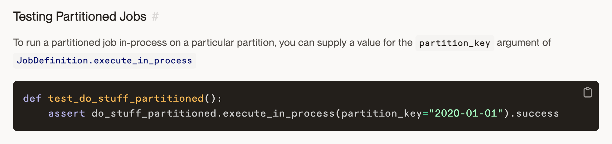

Hi, here is the place I will tell you why I create this website. The whole idea start from this tweet

<blockquote class="twitter-tweet">
รู้สึกว่าต้องรวบรวมท่าเขียนเทสของ Dagster ละ Dagster testing cookbook ไรงี้
&mdash; Yothin M 🐍✨ (@yothinix) <a href="https://twitter.com/yothinix/status/1577936359192657920?ref_src=twsrc%5Etfw">October 6, 2022</a></blockquote> 

The story behind it was, I developing "a sensor to trigger my partitioned data pipeline from an assets materialization". Since I was never use the sensor feature along with assets before, the first intuition that came up to my mind is to go for the Official Docs

It was good, clearly explain how to test a sensor in one block of code, but here is the problem. It often that when you develop something it was not straightforward like the example, It was build up on layer of layer of knowledge. Let see what I developing again one more time

* a sensor to trigger 
* my partitioned data pipeline 
* from an assets materialization

The official docs only explain me the first part of the problem, For the two remain part is still no where to go for me here in the official doc, So I went to the second place I usually went to when I can not find things I want to know in Dagster, The Dagster Slack Community.

From there, I went go for search with a simple keyword that I know it cover what I want for my use case "testing assets sensor" and after skim down a bit I found a specific thread with the same problem to me. And Elementl team is support on the thread with the example which give me enough clue that as I understand, In order to test the assets sensor, I need to create the materialization event and to create event I need a job to be executed just like how we test the job.

This seems to solved the 3rd bullet of my problem, by the way I came to realize that my use case have one last problem, the "partitioned data pipeline" since I was not create an asset materialization through the assets graph but generate the event as part of the ops. 

So after digging around the `build_assets_job` I came to realize that the normal job definition come with `execute_in_process` method already and I know how to use it! from there I go back to the official docs again and I know where I was looking for "Testing Partitioned Jobs"

I learned that there is a `partition_key` argument I can pass to the method to create an execution for fixed partition, So all I need to do is to build a partition job execute it with `partition_key` and if the execution go well, then I should have an asset event which I can use for testing at first place.

The story end with I finally able to test the sensor as I want at first place, but then I look back at how I went through docs and community in order to achieve what I want. I came to realize that there will be another me to go through all of this again. 

It was a good journey definitely I was learning things layer by layer, but if another me has a more complex layer than what I was went through I could save their time by providing a solution as I went through and they could focus on the remain problem.

Which is why I start this project, it can act like a set of specific recipe for specific problem and can help another me in the future to not digging through the same path like me again and focus on the remain problem with ease.